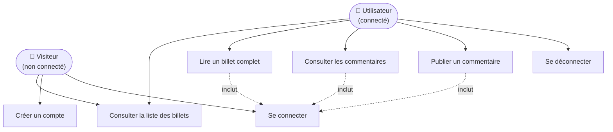
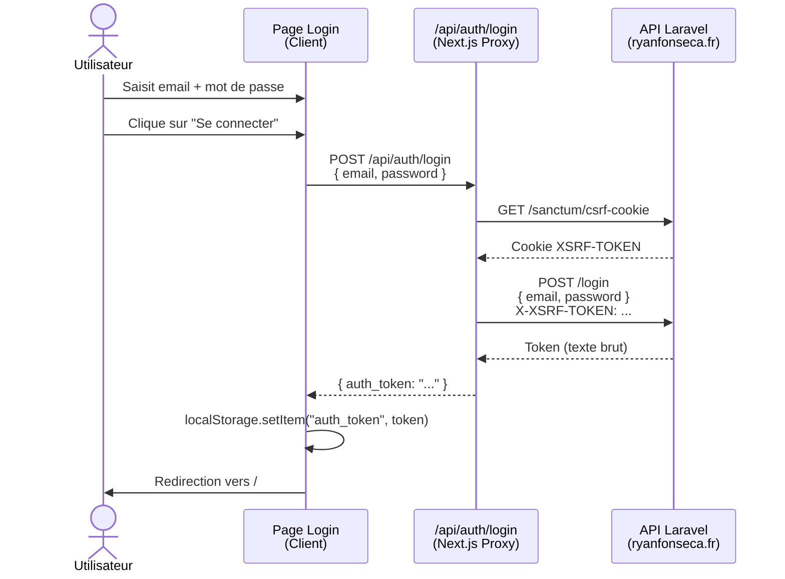
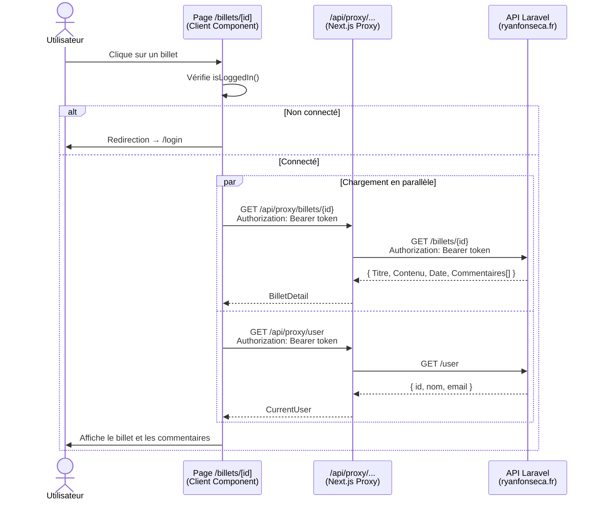
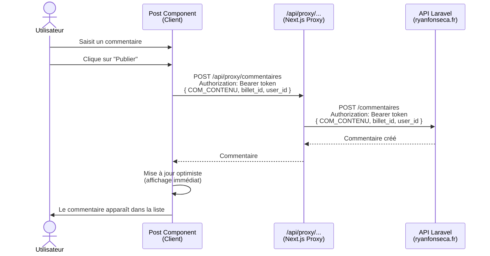

# MonBlog — Documentation technique

> Projet réalisé dans le cadre de l'épreuve **E6 du BTS SIO option SLAM**.
>
> **Auteur :** Ryan Fonseca  
> **Déploiement :** https://b2lp-ryan.vercel.app

---

## Présentation

MonBlog est une application web de consultation et de commentaire de billets (articles). Elle est développée avec **Next.js 16** (App Router) et consomme une API REST externe développée avec **Laravel Sanctum**.

Les utilisateurs peuvent :
- Consulter la liste des billets sans être connectés.
- Lire le contenu complet d'un billet et ses commentaires (authentification requise).
- Publier un commentaire sur un billet (authentification requise).
- Créer un compte et se connecter.

---

## Stack technique

| Couche | Technologie |
|---|---|
| Framework front-end | Next.js 16.1.6 (App Router) |
| Bibliothèque UI | React 19 |
| Typage | TypeScript |
| Styles | Tailwind CSS v4 |
| API back-end | Laravel (Sanctum) — hébergée sur `ryanfonseca.fr` |
| Déploiement | Vercel |

---

## Arborescence du projet

```
monBlogNextjs/
├── app/
│   ├── api/
│   │   ├── auth/
│   │   │   ├── login/route.ts       # Proxy POST /login (gestion CSRF Sanctum)
│   │   │   └── register/route.ts    # Proxy POST /register
│   │   └── proxy/
│   │       └── [...path]/route.ts   # Proxy générique → API externe (contourne CORS)
│   ├── billets/
│   │   └── [id]/
│   │       └── page.tsx             # Route dynamique : détail d'un billet
│   ├── components/
│   │   ├── allPosts.tsx             # Server Component : liste des billets
│   │   ├── footer.tsx
│   │   ├── header.tsx               # Gère l'état de connexion dans la navbar
│   │   ├── login.tsx                # Formulaire de connexion
│   │   ├── post.tsx                 # Client Component : billet + commentaires
│   │   └── register.tsx             # Formulaire d'inscription
│   ├── lib/
│   │   ├── api-config.ts            # URLs de base et endpoints de l'API
│   │   ├── auth.ts                  # Fonctions isLoggedIn / getAuthToken
│   │   └── utils.ts                 # formatDate (ISO → français)
│   ├── login/page.tsx
│   ├── register/page.tsx
│   ├── services/
│   │   └── BilletService.ts         # Point d'entrée unique vers l'API
│   ├── types.ts                     # Types partagés (Billet, Commentaire, CurrentUser…)
│   ├── globals.css
│   ├── layout.tsx                   # Layout racine (Header + Footer)
│   └── page.tsx                     # Page d'accueil → <AllPosts />
├── public/
├── next.config.ts                   # Headers de sécurité (CSP, X-Frame-Options…)
├── package.json
├── tsconfig.json
└── vercel.json
```

---

## Cas d'utilisation



---

## Appels à l'API externe

L'API REST est hébergée à l'adresse `https://www.ryanfonseca.fr/b2lp/api`. Tous les appels passent par la classe `BilletService` (`app/services/BilletService.ts`), qui est le **seul point de contact** avec le back-end.

### Endpoints utilisés

| Méthode | Endpoint | Auth requise | Description |
|---|---|---|---|
| `GET` | `/billets` | Non | Récupère la liste de tous les billets |
| `GET` | `/billets/{id}` | Oui (Bearer) | Récupère un billet et ses commentaires imbriqués |
| `GET` | `/user` | Oui (Bearer) | Récupère les infos de l'utilisateur connecté |
| `POST` | `/commentaires` | Oui (Bearer) | Publie un nouveau commentaire |
| `POST` | `/login` | Non | Authentification (via proxy Next.js) |
| `POST` | `/register` | Non | Création de compte (via proxy Next.js) |

### Mécanisme de proxy (contournement CORS)

L'API n'autorise les requêtes directes que depuis le domaine Vercel de production. En développement local, les requêtes du navigateur seraient bloquées par la politique CORS. Pour résoudre ce problème, `BilletService.request()` adopte deux comportements selon le contexte :

- **Côté serveur** (Server Components, exécution Node.js) : appel direct vers `https://www.ryanfonseca.fr/b2lp/api`.
- **Côté navigateur** (Client Components) : appel vers `/api/proxy/...`, un proxy interne Next.js qui transfère la requête au vrai serveur côté Node.js, sans restriction CORS.

```
Navigateur
    │
    ▼
/api/proxy/billets        ← même domaine, pas de CORS
    │ (Next.js Route Handler, côté serveur)
    ▼
https://www.ryanfonseca.fr/b2lp/api/billets
```

### Authentification par Bearer Token

1. Lors de la connexion, le token renvoyé par l'API (en texte brut) est normalisé par le proxy `/api/auth/login` en `{ auth_token: "..." }`.
2. Le token est stocké dans le `localStorage` sous la clé `auth_token`.
3. Pour chaque requête protégée, `BilletService.request()` récupère le token via `getAuthToken()` et ajoute l'en-tête `Authorization: Bearer <token>`.

### Gestion du CSRF (Laravel Sanctum)

La connexion et l'inscription passent par des proxies Next.js dédiés (`/api/auth/login` et `/api/auth/register`) qui effectuent préalablement un handshake CSRF côté serveur :

1. Appel à `https://www.ryanfonseca.fr/b2lp/sanctum/csrf-cookie` pour obtenir le cookie `XSRF-TOKEN`.
2. Transmission du token CSRF dans l'en-tête `X-XSRF-TOKEN` lors de la requête `POST /login`.

### Format des données

L'API retourne des champs avec des noms français capitalisés :

```typescript
// Billet (GET /billets)
{ id: number, Titre: string, Contenu: string, Date: string,
  Categories: [{ Id: number, Libelle: string }] }   // tableau éventuellement vide

// BilletDetail (GET /billets/{id})
{ id, Titre, Contenu, Date, Categories: [...], Commentaires: [{ id, Auteur, Contenu, Date }] }

// CurrentUser (GET /user)
{ id: number, nom: string, email: string }

// Payload pour POST /commentaires
{ COM_CONTENU: string, billet_id: number, user_id: number }
```

---

## Diagrammes de séquence

### Connexion de l'utilisateur



---

### Consultation d'un billet avec commentaires



---

### Publication d'un commentaire



---

## Fonctionnalité : catégories des billets

> Ajoutée sur la branche `categorie`. Permet d'afficher les catégories de chaque billet et de filtrer la liste par catégorie.

### Contexte côté API

Le back-end associe désormais à chaque billet une liste de **catégories** (ex : `monopalme`, `bi-palmes`, `compétition`, `sécurité`, `randonnée palmée`). Un billet peut en avoir 0, 1 ou plusieurs.

- `GET /billets` renvoie le champ `Categories` (tableau, éventuellement vide) pour chaque billet — **sans authentification**.
- `GET /billets/{id}` renvoie également `Categories` (en plus de `Commentaires`).
- ⚠️ **Il n'existe pas d'endpoint `/categories`** : la liste des catégories disponibles est **déduite côté front** à partir des billets reçus (déduplication par `Id`).

### Choix d'implémentation : filtrage côté client

Le filtrage est réalisé **côté client**, sur le tableau de billets déjà chargé, plutôt que via le paramètre serveur `?categorie_id=`. Raisons :

- L'intégralité des billets, **catégories incluses**, arrive en un **seul appel** `GET /billets`.
- Il n'y a pas d'endpoint `/categories` : la liste des filtres est de toute façon dérivée des billets en mémoire.
- `AllPosts` est un **Server Component** ; un filtrage serveur imposerait un re-fetch à chaque clic et obligerait à transformer cet appel en requête navigateur (via le proxy). Le filtrage en mémoire est instantané et sans requête supplémentaire.

### Architecture de la fonctionnalité

Contrainte clé : `AllPosts` est asynchrone et s'exécute côté serveur (il fait le fetch), alors que le filtre a besoin d'un **état client** (`useState`). La solution : garder le fetch côté serveur et déléguer le rendu interactif à un Client Component qui reçoit les billets en props.

```
AllPosts (Server Component)         ← fetch GET /billets (serveur, inchangé)
   │ billets (props)
   ▼
BilletsList (Client Component)      ← état du filtre + dérivation des catégories
   ├── CategoryFilter               ← barre de chips ("Toutes" + catégories)
   └── BilletCard ×N
          └── CategoryChips         ← badges des catégories du billet
```

### Fichiers ajoutés / modifiés

| Fichier | Type | Rôle |
|---|---|---|
| `app/types.ts` | modifié | Ajout du type `Categorie` (`Id`, `Libelle`) et du champ `Categories?` sur `Billet` (hérité par `BilletDetail`). |
| `app/lib/utils.ts` | modifié | `extractCategories()` (déduplication par `Id` + tri alphabétique FR) et `filterBilletsByCategorie()` — **fonctions pures, testables**. |
| `app/components/categoryChips.tsx` | créé | Badges présentationnels des catégories, réutilisés sur la carte et sur le détail. Ne rend rien si aucune catégorie. |
| `app/components/categoryFilter.tsx` | créé | Barre horizontale scrollable de chips (`Toutes` + une chip par catégorie), avec `aria-pressed`. |
| `app/components/billetsList.tsx` | créé | **Client Component** : gère l'état du filtre, dérive les catégories, affiche la liste filtrée. Contient `BilletCard`. |
| `app/components/allPosts.tsx` | modifié | Reste un **Server Component** (fetch inchangé) ; délègue le rendu de la liste à `<BilletsList>`. |
| `app/components/post.tsx` | modifié | Affiche les catégories du billet sur l'écran de détail. |

### Gestion des états

- **Liste globale vide** (aucun billet renvoyé par l'API) : gérée par `AllPosts` (« Aucun billet pour l'instant »).
- **Filtre ne renvoyant aucun billet** : message dédié dans `BilletsList` (« Aucun billet dans cette catégorie », invite à revenir sur « Toutes »).
- **Billet sans catégorie** : `CategoryChips` ne rend rien (pas de conteneur vide).
- **Aucune catégorie sur l'ensemble des billets** : la barre de filtre n'est pas affichée.

### Validation

| Vérification | Résultat |
|---|---|
| `npm run lint` | ✅ aucun warning |
| `npm run build` | ✅ TypeScript + frontière Server/Client OK |
| Logique pure (`extractCategories` / `filterBilletsByCategorie`) | ✅ déduplication par `Id`, tri avec accents FR, option « Toutes », filtre par catégorie, catégorie inexistante → liste vide |
| Rendu réel (`npm run dev`) | ✅ chips triées/dédupliquées, accents UTF-8 corrects, billet sans catégorie géré, détail intact |

> ℹ️ L'endpoint `GET /billets` renvoie actuellement une liste vide en production ; le rendu visuel a donc été validé avec un jeu de données de test temporaire, retiré après vérification.

---

## Lancer le projet en local

```bash
# Installer les dépendances
npm install

# Démarrer le serveur de développement
npm run dev
```

L'application sera accessible sur [http://localhost:3000](http://localhost:3000).

Les appels à l'API externe transitent automatiquement par le proxy Next.js — aucune variable d'environnement n'est nécessaire en développement.

| Commande | Description |
|---|---|
| `npm run dev` | Serveur de développement (hot reload) |
| `npm run build` | Build de production |
| `npm run start` | Démarre le build de production |
| `npm run lint` | Analyse statique ESLint |

---

## Sécurité

Le fichier `next.config.ts` configure les en-têtes HTTP suivants sur toutes les routes :

| En-tête | Valeur | Rôle |
|---|---|---|
| `Content-Security-Policy` | `connect-src 'self'` (entre autres) | Bloque les requêtes vers des domaines non listés |
| `X-Frame-Options` | `DENY` | Empêche l'intégration dans une iframe (clickjacking) |
| `X-Content-Type-Options` | `nosniff` | Empêche le MIME-sniffing |
| `Cache-Control` | `no-store` sur `/login` et `/register` | Évite la mise en cache de données sensibles |

La directive `connect-src 'self'` fonctionne parce que **toutes les requêtes du navigateur passent par le proxy `/api/proxy`** (même domaine). Une requête directe vers l'API externe depuis un Client Component casserait la CSP.
